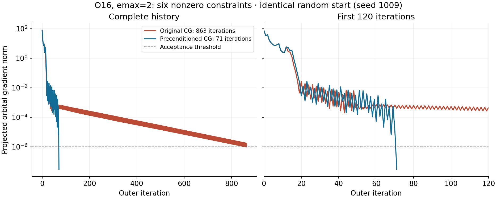

# Accelerating constrained hybrid HF — 2026-10-08

The orbital-gap preconditioner from the CC `hf_real` approach reduces the hardest
saved O16 random start from **863 to 71 outer iterations**, at unchanged physical
convergence tolerances. All ten O16 random starts now converge in **32–117**
iterations. Preconditioning is enabled by default in the Python hybrid solver.

## Diagnosis and comparison

The emax=2 O16 fixture imposes Q20=0.2 fm², Q22sum=0.1 fm², Q10=0.03 fm,
Q30=0.05 fm³, Jx=0.02 and Jz=0.01 in hbar, plus Q21=0. The Hamiltonian is the
small Minnesota + intrinsic-kinetic-energy IMSRG(2) fixture, evolved only to
s=0.2; it is an interface benchmark, not a production nuclear prediction.

For Gaussian/QR seed **1009**, the original inner conjugate-gradient solve hit
its 35-step cap in **828 of 851 Newton calls**. Energy changes had already become
small while the projected gradient decayed slowly. Small energy changes alone
were insufficient to accept the determinant.

The following variants used the identical saved starting orbitals, internal seed
520, target constraints, and acceptance tolerances. Times exclude input loading
and are individual local WSL runs with one BLAS/OpenMP thread.

| Method | Outer iterations | Fock evaluations | Hessian evaluations | Inner cap hits | Solve seconds |
| --- | ---: | ---: | ---: | ---: | ---: |
| Original CG, 35 inner steps | 863 | 892 | 29379 | 828 | 6.668 |
| CG, 80 inner steps | 68 | 109 | 1553 | 0 | 0.470 |
| **Preconditioned CG, 35 inner steps** | 71 | 116 | 989 | 3 | 0.435 |

Increasing the inner cap removes the long tail, but preconditioning with the
original cap uses fewer Hessian evaluations. The selected method reduces Hessian
work from 29,379 to 989 (about 30-fold) and solve time from 6.67 to 0.435 seconds
in this comparison (about 15-fold). The two solutions agree in energy within
1e-11 MeV, at approximately -186.53266345588 MeV. The final projected gradient
improves from 9.93e-7 to 2.99e-8. Timings and iteration counts can vary with the
numerical environment; an iteration count is not itself a measure of total work.



The plot shows both the complete convergence history and the first 120 iterations.
The dashed line is the unchanged gradient acceptance threshold; moment,
energy-change and constrained-curvature checks must also pass.

## Method and memory

For each species, the solver diagonalizes the occupied and virtual blocks of the
current constrained Fock field F + sum(lambda Q_field), separately. In these
semicanonical particle-hole coordinates the positive inverse approximation is

```text
M_ai = 1 / [2 max(precondition_floor, abs(e_virtual[a] - e_occupied[i]))]
```

The residual and preconditioned vector stay in the joint proton–neutron moment
constraint tangent space. The positive floor keeps the metric defined near
degenerate gaps and at indefinite points. This approximation is used only to
accelerate CG. The Hessian action still contains the exact Hamiltonian response
and the density-dependent response of any two-body constraints. The CG residual
test uses the physical, unpreconditioned residual norm.

Backtracking, the step-radius bound, negative-curvature handling and final
stability checks remain active. The new arrays require O(dp² + dn²) storage and
fit within the existing conservative solver allowance; no dense particle-hole
Hessian or growing iteration history is allocated by the preconditioner.
Hamiltonian storage is still the dominant dense O(d⁴) limitation. The configured
memory budget remains an admission estimate, not an operating-system RSS cap.

This implementation benefits from **Gaute and Thomas's CC code**, specifically
`hf_real/hf_hybrid_bridge.f90`: its `prepare_preconditioner`,
`precondition_residual` and preconditioned Newton-CG routines. MyHF adapts that
technique to its joint constraint projection and evolved two-body operators.
Ragnar Stroberg's IMSRG code supplies the fixture/operator conventions described
in [EVOLVED_GCM.md](../EVOLVED_GCM.md).

## Independent starts and regression checks

The installed implementation was replayed against the exact saved starting
orbitals from the [original random-start study](RANDOM_STARTS.md). Each solve was
independent, with no continuation. The ranges below exclude the reference start.

| Case | Accepted random starts | Original iterations | Preconditioned iterations | Median, original → new |
| --- | ---: | ---: | ---: | ---: |
| USDA Mg24 | 10/10 | 19–52 | 19–46 | 29 → 28.5 |
| Ne20, evolved 1b+2b quadrupole | 10/10 | 23–35 | 22–34 | 27.5 → 29 |
| O16, six nonzero constraints | 10/10 | 33–863 | 32–117 | 245.5 → 72 |
| O17, emax=3 | 10/10 | 19–25 | 18–24 | 21 → 21 |

All **40 random starts and four reference starts** passed the original gradient
(1e-6), moment (1e-8), energy-change (1e-8 MeV) and constrained-curvature (-1e-5)
checks. Four `.inp` scan examples accepted **9/9 distinct points** and completed
18 directional attempts; resuming them left the attempt journals unchanged.
The full regression suite passed **30/30 tests**. New tests check positive and
symmetric preconditioning, constraint tangency, empty/full species, input
validation, and convergence of seed 1009 within 150 outer iterations.

Some O16 starts land on different accepted local minima after preconditioning.
For example, seed 1003 reaches a lower branch, while seed 1007 reaches a branch
about 0.00236 MeV higher than before. The lowest sampled O16 branch is retained.
The energy agreement quoted above applies to the hardest seed 1009, not to all
starting states. Multiple starts and scan directions remain useful; local
convergence and curvature checks do not prove a global minimum.

The exact installed-code results, starting-state hashes and source hashes are in
[preconditioner_validation.json](preconditioner_validation.json). The five-method
ablation, including per-Newton-call residual diagnostics, is in
[preconditioner_ablation.json](preconditioner_ablation.json); the full regression
log is [preconditioner_tests.txt](preconditioner_tests.txt). The earlier recorded
benchmarks retain their original numerical results and hashes.

## Input and reproduction

No input changes are needed to enable the new default. Optional controls are:

```ini
[solver]
method             = hybrid
precondition       = yes
precondition_floor = 0.1          # minimum absolute orbital gap, MeV
max_cg             = 35           # inner CG steps per Newton call
```

Use `precondition = no` for a diagnostic comparison with the original CG method.
The floor must be finite and positive. It changes the search metric, not the
Hamiltonian, target moments or acceptance tolerances. Results now also report
`cg_iterations`, `cg_limit_hits` and `preconditioner_evaluations`.

From `MyHF/`, with the native extension built:

```sh
OMP_NUM_THREADS=1 MKL_NUM_THREADS=1 OPENBLAS_NUM_THREADS=1 python3 -m unittest discover -s tests -v
python3 tests/benchmark_random_starts.py --input examples/gcm/multishell_o16.inp --seeds 1009 --output Output/o16_pcg_seed1009
python3 tests/benchmark_random_starts.py --input examples/gcm/multishell_o16.inp --output Output/o16_pcg_random
```

To compare without preconditioning, copy the `.inp` file in the same directory,
add `precondition = no` under `[solver]`, and run the same command with that input
and a different output directory. Set `max_cg = 80` in another copy to test the
larger inner solve. Keep all other settings fixed. The benchmark includes one
reference run even when a single random seed is selected.

**Use fresh output directories after this solver update.** Named-driver resume
checks include source hashes and reject incompatible old checkpoints. The saved
earlier production PES files are preserved. This update changes the Python hybrid
workflow, not the legacy native `HartreeFock.exe` constrained routine.
